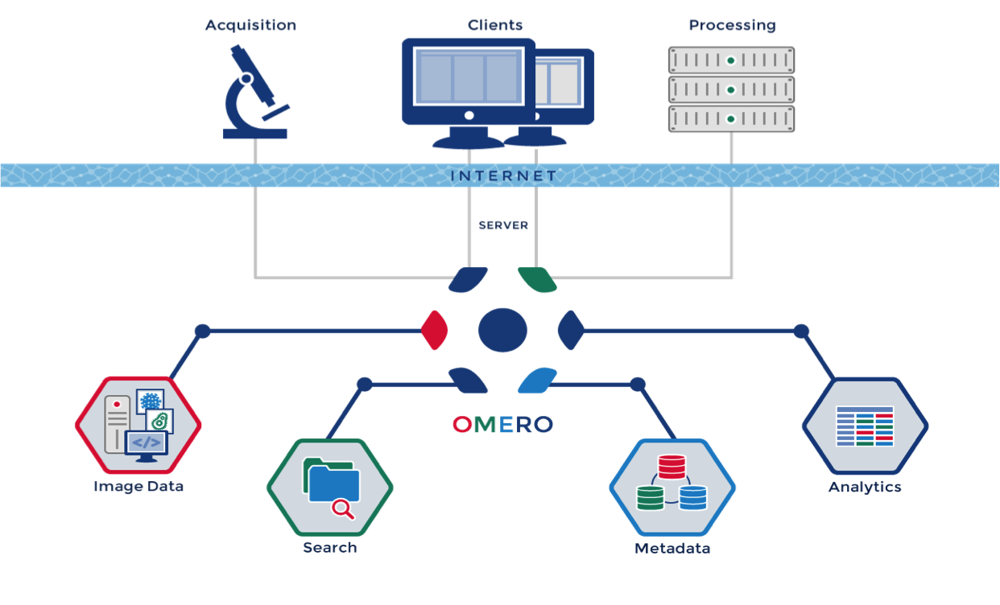
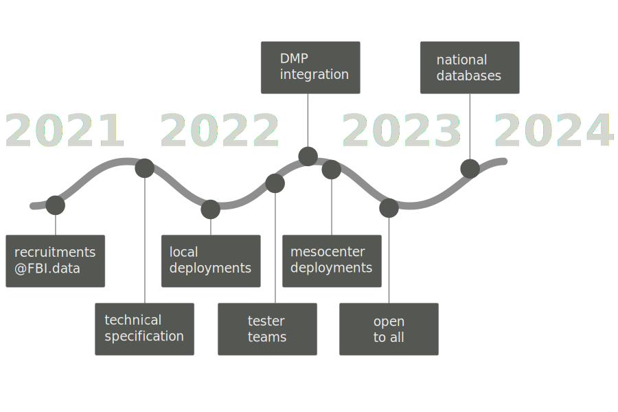

# What?

:::::::::::::: {.columns}
::: {.column width="40%"}

[OMERO](https://openmicroscopy.org/omero) is a microscopy image management platform.
It helps you **organize**, **access** and **archive** your data.

:::
::: {.column width="60%"}

:::
::::::::::::::

# Why?

## Microscopy data are big and complex

* Long experiments
* Data intensive microscopes (e.g. light sheet)
* Complicated data (super-resolution, spatial transcriptomics ...)

> We need to **organize** both data and metadata

# What's in it for you as a researcher?

## Access your data from anywhere

* Browse and build figures directly from the web
* Connect to OMERO through
your prefered tools (ImageJ, Napari, QPath, etc.)

## Keep your data findable and usable

* Keep track of all important metadata
* Organize with **tags** and **annotations**
* Find your data even once your student is gone
* Easily share with data analysts

## Keeping your data safe

Your microscopy data will be stored

- in the datacenter
- with on-site and off-site backups
- by data management professionals

## Your data become [FAIR](https://www.go-fair.org/fair-principles/)

* **Findable** : through filenames, annotations, tags
* **Accessible** : publish & share from the web client
* **Interoperable** : download in a standard format
* **Re-usable** : tracked metadata

# How?

## The new data life cycle

 1. Acquire → 2. Import → 3. Analyze → 4. Publish → 5. Archive 

## Roadmap

