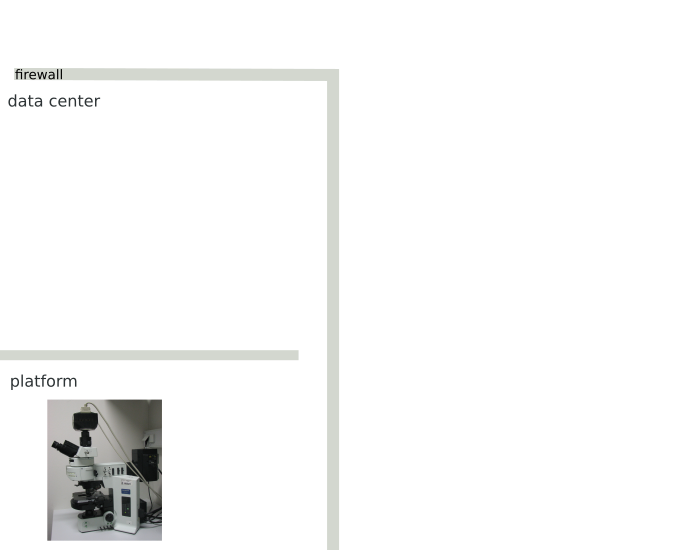
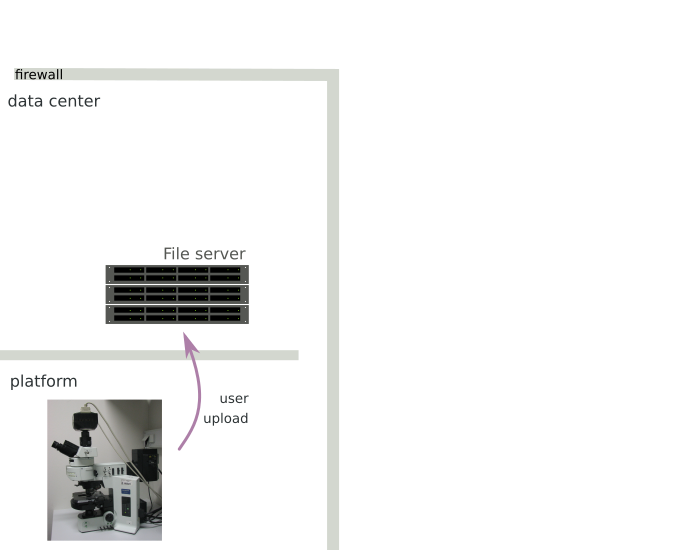
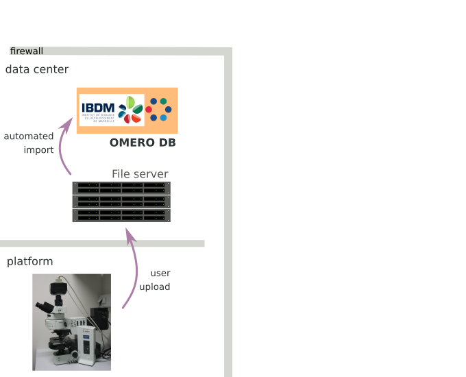
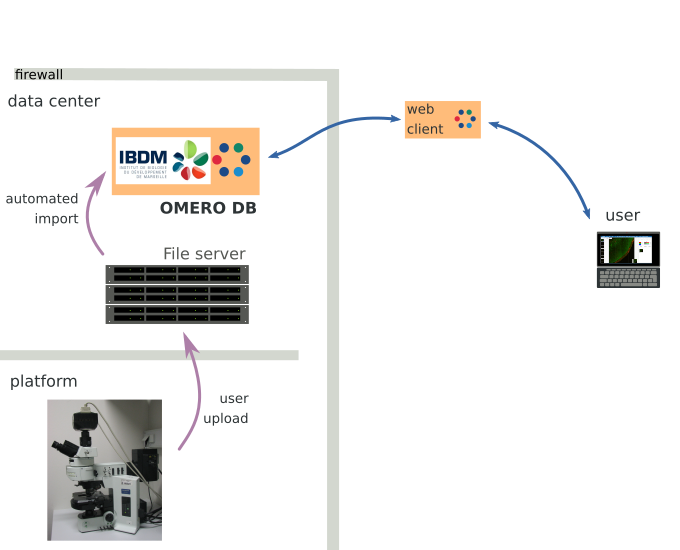
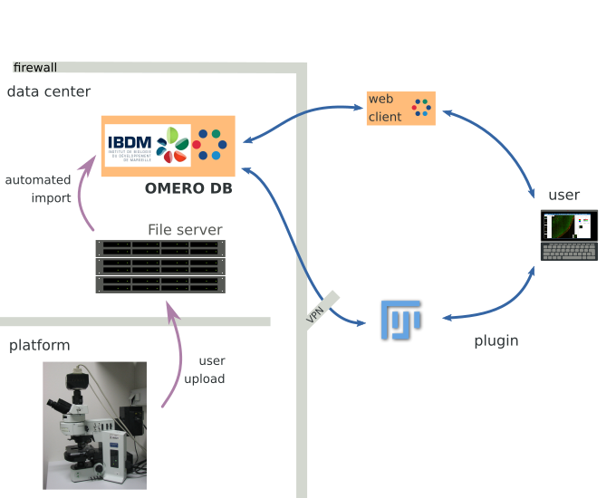
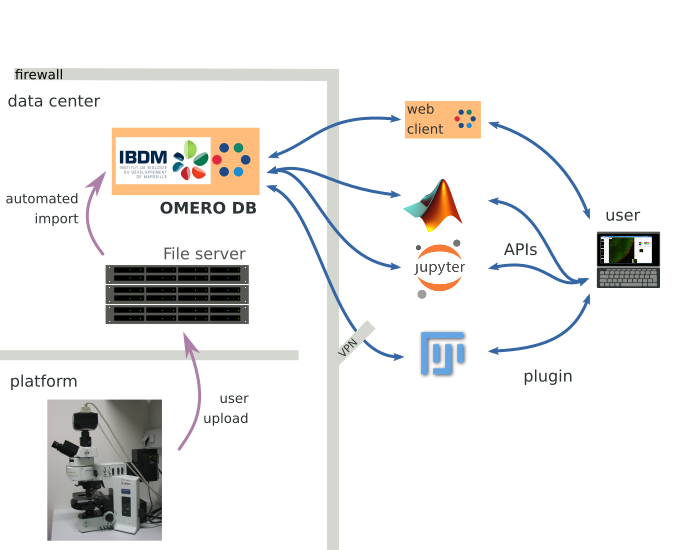
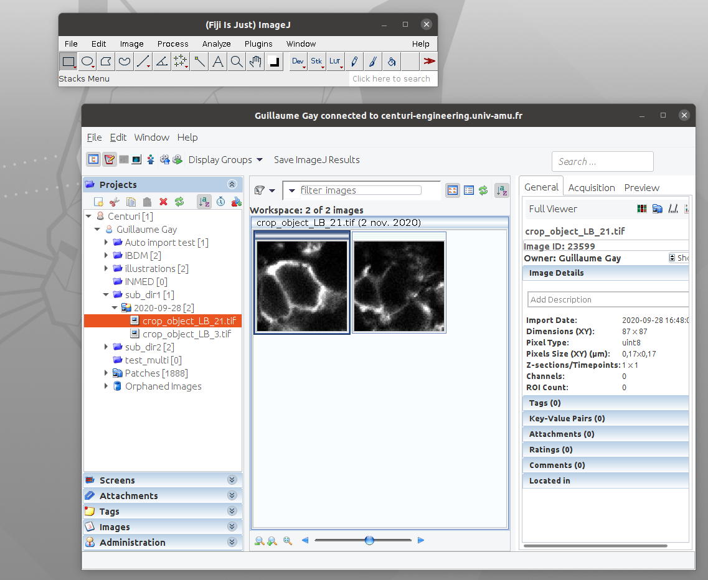

---
title: Adopting OMERO for your microscopy data
author: Guillaume Gay, CENTURI
date: Novembre 2020
fontsize: 10pt
width: 1024
height: 780
center: false
...

# Why?

## Microscopy data is big and complex

* Long experiments
* Screens (maybe not here)
* Data intensive microscopes (e.g. Light sheet)
* Complicated data (super-res, speckle)

---------

> Need to **organize** both data and metadata

## Keeping data accessible

(for you and others)

* A file browser is not a data management tool
* Enforcing standards within your group can be hard
* What happens when students / post-doc are gone?
* Collaboration with data-scientist can be a challenge

## Data management plan

* Mandated by institutions or the ANR (since last year)
* As open as possible, as closed as necessary
* Here is a [template](https://dmp.opidor.fr/template_export/1858712127.pdf)

## FAIR

> **F**indable

> **A**ccessible

> **I**nteroperable

> **R**e-usable data

# What?

## Some history

- 1990s first commercial CCD
- 2000-2010 the Metamorph era (and nd / stk files)
- 2005 sq. formats explosion (vendor lock-in strategy)
- since 2010 :
  * change of paradigm regarding open-source,
  * federation of global microscopy community

## Openmicroscopy provides standards

- Managed by [the U. of Dundee group](https://www.openmicroscopy.org/) / Glencoe software (Jason Swedlow, Josh Moore)
- Defined OME-TIFF (data + metadata in a single file)
- created BioFormats
- Omero is also used in the industry (CROs, Perkin Elmer)

------------------

* one server / multiple clients
* user groups / permission granularity

## Dataflow

## {data-transition="None"}

## {data-transition="None"}

## {data-transition="None"}

## {data-transition="None"}

## {data-transition="None"}

## {data-transition="None"}

## {data-transition="None"}

--------

> raw data is not (necessarily) copied

## Data Federation

At the University, National and International levels

## Features overview

### Webclient

* [Browser](https://centuri-engineering.univ-amu.fr/omero/)

* [Viewer](https://centuri-engineering.univ-amu.fr/omero/webclient/img_detail/18498/?dataset=892)

* [ROIs](https://centuri-engineering.univ-amu.fr/omero/webclient/img_detail/23604/?dataset=1249) are managed (also to/from ImageJ)

* [3D Viewer](https://centuri-engineering.univ-amu.fr/omero/fpbioimage/viewer/11063/)

* [Figure](https://centuri-engineering.univ-amu.fr/omero/figure/file/141436)

### Search and Annotations

* Readily available: search over names
* Annotations are harder
* [Cards based annotations](https://centuri-engineering.univ-amu.fr/cataloger/)

### Fiji Plugin

# How and when?

## Costs

* One server (less than 3k€)
* Mainly HR

## HR implications

* Research engineer @ 50% FTE (centuri):

  - manage the federated databases
  - interface with data analysts
  - custom dev

. . .

* In each institute:

  - Training session
  - Referee for user management / on site admin
  - A "backup" sysadmin

## When?

## Setup step (first trimester 2021)

* Renew list of personnel, access to disks
* Automated import strategy (old data)
* Automated import strategy (new data)
* Automated annotation ?

## Usage and adoption (throughout 2021)

* Training of post-docs & PhDs
* Freezing of the production workflow

# Conclusion

* **Findable** : through filenames, annotations
* **Accessible** : publish & share from the web client
* **Interoperable** : download in a standard format
* **Re-usable** : tracked metadata
