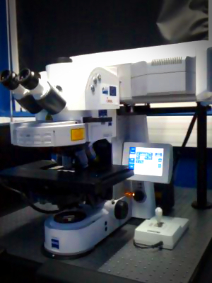

---
title: Données de microscopie photonique à l'AMU
subtitle: outils, annotations, stratégies d’adoption
author: Guillaume Gay, CENTURI Multi-Engineering Platform
logo: images/bleu.png
date: 19/11/2021
fontsize: 10pt
width: 1024
height: 780
center: true
section-titles: false
theme: Montpellier
colortheme: seagull
...

# Les images de microscopie de fluorescence

## Une grande diversité d'instruments

:::::::::::::: {.columns}
::: {.column width="50%"}
\vspace{2cm}

* Confocal _spinning disk_
* À feuille de lumières
* Super-résolution
* Instruments «faits maison»
:::
::: {.column width="50%"}
{ height=80% }
:::
::::::::::::::

## Les plateformes de microscopie

:::::::::::::: {.columns}
::: {.column width="50%"}
\vspace{2cm}

* Mise en commun des instruments (une douzaine de microscopes)
* Personnel plateforme: suivi technique & maintenance
* Formation des utilisateurs
:::
::: {.column width="50%"}
{ height=60% }
:::
::::::::::::::

## Structure et type de données

:::::::::::::: {.columns}
::: {.column width="50%"}
\vspace{2cm}

* sectionnement optique → données 3D
* imagerie du vivant → multiples points de temps
* multi-cannaux
:::
::: {.column width="50%"}
{ height=60% }
:::
::::::::::::::

**Total de l'ordre de 2 Po / an**

# Gestion des données

## Enjeux de conservation

- Traçabilité des métadonnées

  * d'instrumentation
  * expérimentales

- Conservation des données secondaires

  * segmentations et régions d'intérêt
  * méthodes d'analyse (_workflows_)

- Constitution d'ensembles d'apprentissage pour le _deep learning_

  * dépend de l'annotation correcte
  * accessibilité d'infrastructures de calcul (en particulier GPU)

## Outils de conservation

## Automatisation

:::::::::::::: {.columns}
::: {.column width="50%"}

:::
::: {.column width="50%"}

:::
:::::::::

## À faire

- Intégration :

  - Lien avec le SI des labos
  - Authentification commune

- Culture de la gestion des données :

  - Formation aux outils par les plateformes
  - Outils d'annotation, vocabulaires communs

- _Data Curation_ :

  - Quelles données doit-on garder ?
  - Qui fait ce travail ?

# Conclusion

## Le Projet MuDiS4Ls

Le nœud BioImage Informatics de France BioImaging est partenaire de l'Institut Français de BioInformatique sur le projet **Mutualised Digital Space for FAIR Life Sciences**

* Déploiement d'OMERO dans les mésocentres
* Accessibilité des outils
* Ressources humaines @FBI et dans les laboratoires
* Accompagnement à l'établissement des PGD

## Perspectives: Nouveaux formats de fichiers

> `ome.zarr`: un nouveau format de fichier pour les données de microscopie

:::::::::::::: {.columns}
::: {.column width="80%"}

* ZARR: format de données numériques adapté à l'accès distant:

  * _chunks_
  * accès concurrent
  * stockage orienté objet (S3)

* ome.zarr: spécification des attributs des données de microscopie

  * Données multi-échelle (pyramides)
  * Métadonnées instrumentales (schéma omero)
  * Régions d'intérêt
  * Données tabulaires
  * Maillages, etc.
:::
::: {.column width="20%"}

::::
::::::::::::
